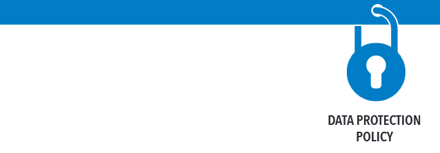

```{r options_communes, include=FALSE}
source("options_communes.R")
```

<div class="important">
This chapter is not written yet.
</div>


##  UNHCR Data Protection Policy

The [Policy on the Protection of Personal Data of Persons of Concern to UNHCR](http://www.refworld.org/docid/55643c1d4.html) has been issued in May 2015. 



In addition of the clarification of the basic principles to be applied when collecting information that includes *personally identifiable information*, the policy recall the  needs to carry out Data Protection Impact Assessment (DPIA). A DPIA is required where the collection and processing or transfer of personal data is likely to be large, repeated or structural. 

Bceause most of "Protection Assessment" fall under that policy as they are linked with the need to be able to process referals, personally identifiable information are often required. In addition, information such a precise coordinates of individuals with specific profile or needs might also fall unde the policy.

## Technical measures necessary to comply with the policy

*  Maintaining physical security of premises, portable equipment, individual case files and records;

*  Maintaining computer and information technology (IT) security, for example, access control (e.g. passwords, tiered access), user control, storage control, input control, communication and transport control (e.g., encryption).

## Standard Operating Procedures necessary to comply with the policy


A DPIA would contain a general description of:

* the envisaged project, 
* data sharing agreement in place
* arrangement involving processing of personal data (for instance clarififcation on protection referal), 
* analysis of the risks to the rights of data subjects by virtue of the circumstances 
* nature of the personal data processed, 
* safeguards and security measures in place or proposed .

## Deleting dataset

Personal data that is not recorded in individual case files is not to be retained longer than necessary for the purpose(s) for which it was collected.

Though this should not minimise the need to save anonymised copies of the dataset in order to ensure potential new analysis of the data or longtidinal analysis. See [the last chapter for more information on this](Microdata.html).